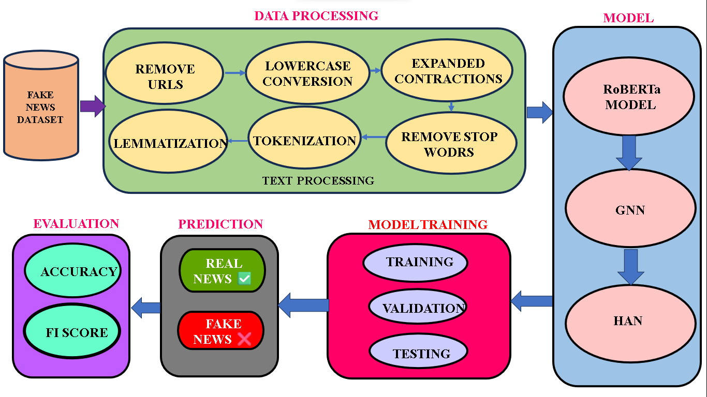
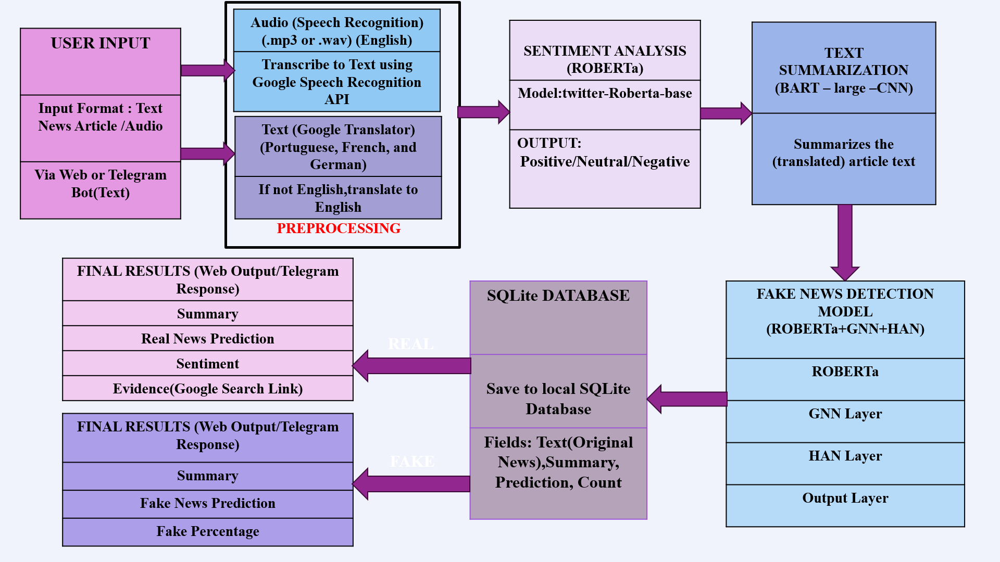

# 🧠 AI-Powered Fake News Detection System

An advanced fake news detection system combining state-of-the-art NLP and graph-based deep learning techniques. This project uses **RoBERTa**, **GNN (Graph Neural Networks)**, and **HAN (Hierarchical Attention Networks)** to classify news articles as **real** or **fake** with high accuracy.

  

---

## 🚀 Features

- 🔎 **Fake News Classification** using a hybrid model (RoBERTa + GNN + HAN)
- 🌍 **Multilingual Support** via Google Translate
- ✂️ **Summarization** using the BART model
- 💬 **Sentiment Analysis** using `cardiffnlp/twitter-roberta-base-sentiment`
- 🎙️ **Audio Input Support** (speech-to-text via Google Speech API)
- 📊 **Fake Probability Score** (outputs percentage fake)
- 🤖 **Telegram Bot Interface** connected via Flask API
- 📝 **User Feedback System** (collects user opinion on predictions)

---

## 📂 Dataset

### 📌 ISOT Fake News Dataset
- `True.csv`: Real news articles  
- `Fake.csv`: Fake news articles  
- ~44,000 articles total  
- **Columns**: `title`, `text`, `label`

### 📌 WeLFake Dataset
- A multilingual dataset containing both English and non-English articles
- Useful for evaluating multilingual robustness

---

## 🧠 Model Architecture

### 1. **RoBERTa**
- Extracts deep contextual embeddings from the input text.

### 2. **GNN (Graph Neural Network)**
- Captures structural and semantic relationships between sentences or keywords as a graph.

### 3. **HAN (Hierarchical Attention Network)**
- Applies attention at both word-level and sentence-level for better interpretability.

These models are combined in a **hybrid ensemble** for robust fake news classification.

  

---

## 📊 Performance Metrics

| Dataset | Accuracy | Precision | Recall | F1-Score |
|---------|----------|-----------|--------|----------|
| **WeLFake** | 97.48% | 97.53% | 97.48% | 97.48% |
| **ISOT**    | 99.77% | 99.77% | 99.77% | 99.77% |

> ✅ Results show near-perfect accuracy on ISOT and high generalization on WeLFake.

---

## 🛠️ Technologies Used

- `Python`
- `Flask` (API and Web Interface)
- `transformers` (RoBERTa, BART)
- `torch` / `torch_geometric`
- `Google Translate API`
- `Google Speech API`
- `Telegram Bot API`
- `ISOT Fake News Dataset`
